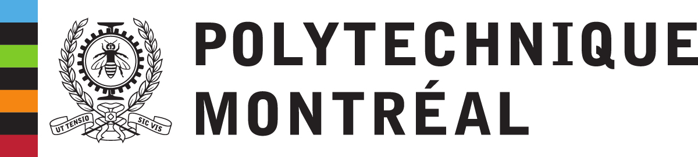
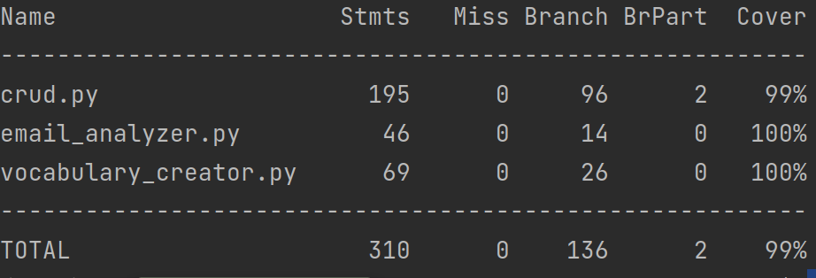

# LOG3430 TP 1 
- Auteurs : Nerese Carlens && Thomas Julien
- le dépot Github dispo [ici](https://github.com/korrigans84/test-python)
## Partie 1

L'objectif de cette partie est de couvrir le code des classes CRUD, EmailAnalyzer et VocabularyCreator.  
Il permet entre autre de voirt l'utilisation des mocks et la création de tests unitaires avec pytest

### Execution
Pour lancer la partie 1 du TP, vous pouvez soit vous placer dans le répertoire src et lancer la commande 
```bash 
./run.sh
```

Ou alors, si vous avez des problème d'environement, et que [Docker](https://docs.docker.com/engine/install/) est installé sur votre machine, executez les 2 commandes suivantes (à la racine du projet) : 

```bash 
docker build -t python-test-coverage .
docker run --rm  python-test-coverage
```

Vous obtiendrez ainsi la couverture suivante : 



